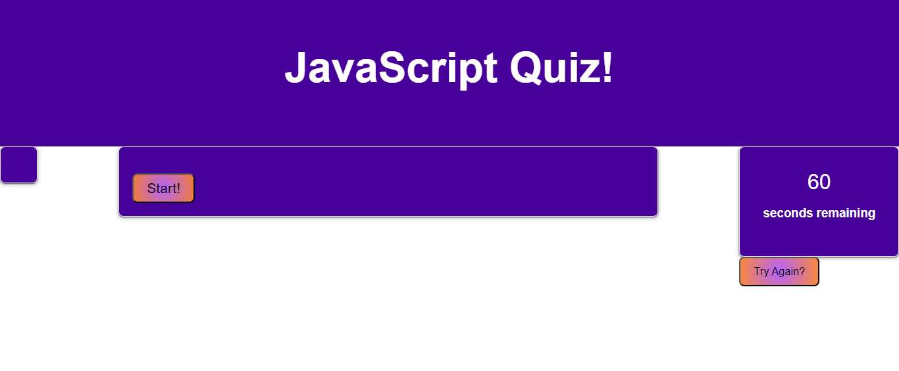
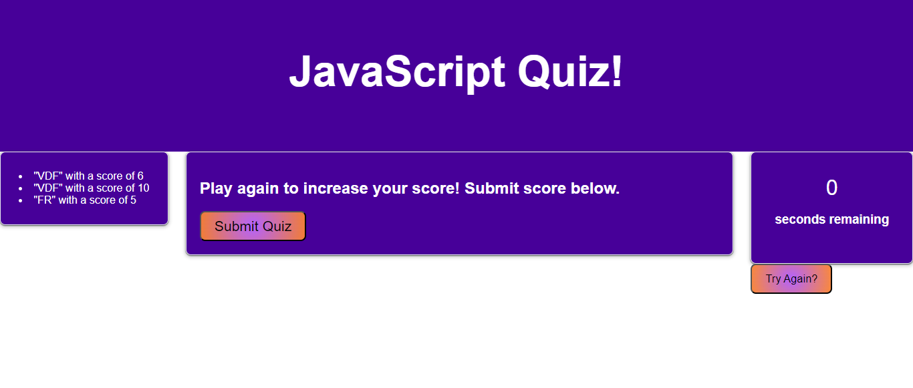

# JavaScript Quiz

## Description

This project was created to study JavaScript, and make use of local storage to reflect a list of initials and scores to look back on and aim to improve. There is sixty-seconds to complete the ten question quiz, but if time runs out the game over screen will run to take initials and show the final score. It can respond to screen changes; it is accessible to phone screens showing the timer at the top instead of the side to easily check on, and tablets make the timer move under the score list to the left of the screen so the questions can expand in the right. This was built to practice the use of local storage as well as practicing the use of JSON properties and rendering new HTML on a page based on the storage return.

## Usage

To use this app, the link is here [LINK](). Hit start to begin the quiz; if the user completes the quiz the timer will stop and an alert will tell them to submit their quiz when ready. After the submission button is hit, a prompt will take the initials entered and reflect them on the screen of the score list. A try again button allows the user to restart the quiz. However, if the user runs out of time, an alert will notify them of this and start the endgame function to take the initials and record the score the user could make.

## Preview

Here is a preview of what the page looks like, from an empty local storage;

And a preview, with a list of scores entered;

## Bugs

In the current form, if you click anywhere but the radio button of the correct answer - including the text of the correct answer, it will deduct time as if it was a wrong answer. This will be addressed when possible. Clicking the radio button of the correct answer is the only option that allows progress.

## Future Plans

I would like to expand on this challenge to fix the only currently known bug, and add an option to see explanations for answers on the screen when answered correctly. This will require implementing next buttons to go to the next question, showing the explanation only after correct answer is hit, and possibly increasing the timer to allow for time to read explanations or pausing the timer until the next button is hit. I would like to include more questions that become more complex, or possibly expand this to allow for different levels of quizzes and a button for each respective difficulty links to it's own quiz page. This could also be made even more complex by implementing an API to allow for logging in to save your scores to a server rather than local storage, or compare your scores among friends.

## Credits

Special thanks to the instructors of my full-stack bootcamp who helped my class learn these skills.

## Contact

My GitHub profile; [LINKK]().